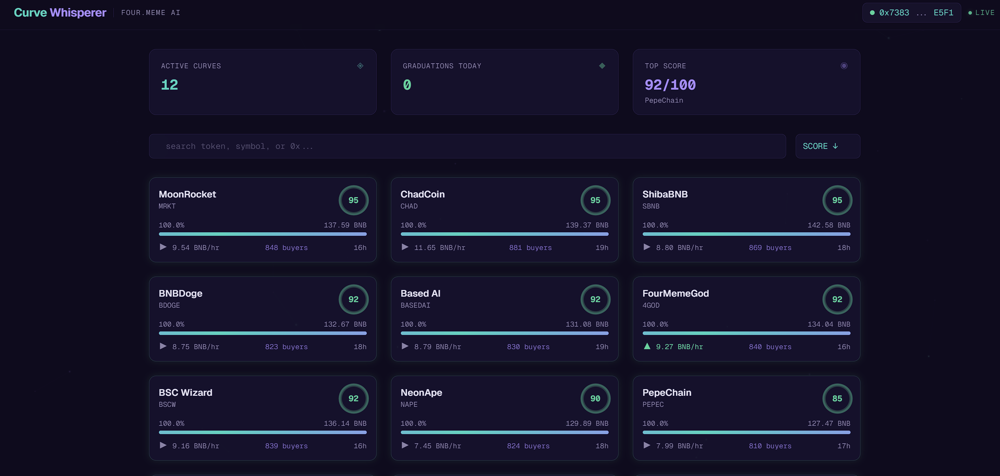
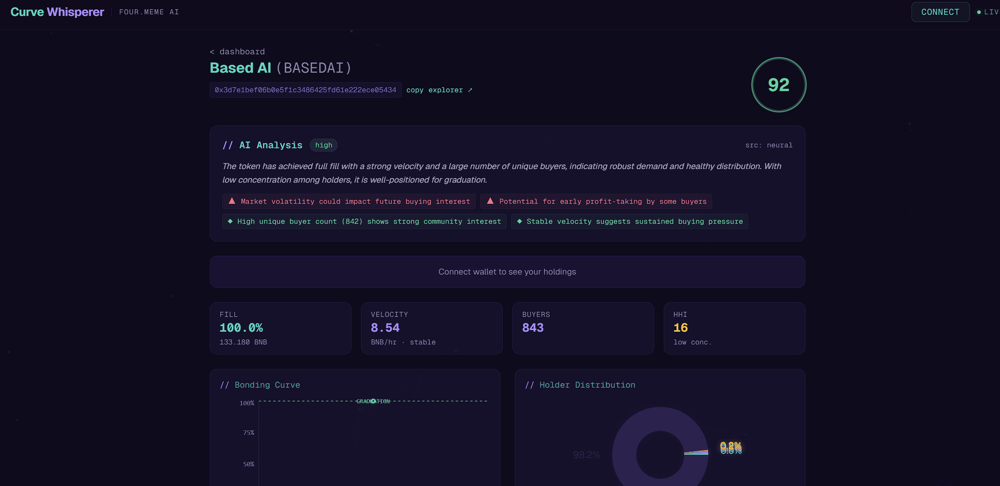

# CurveWhisperer

Real-time AI advisor that analyzes Four.Meme bonding curves, predicts graduation probability, detects whale patterns, and explains risk in plain language — via Telegram bot and web dashboard on BNB Chain.

## Features

- **Graduation Score (0–100)** — AI-generated probability with natural-language explanation
- **Whale Alerts** — large buys, wallet clusters, suspicious concentration patterns
- **Graduation Alerts** — instant notification when a token migrates to PancakeSwap
- **On-Chain Oracle** — BSC smart contract storing AI scores for other dApps to consume
- **Telegram Bot** — `/top`, `/score`, `/watch`, real-time alerts
- **Web Dashboard** — live curves grid, token detail with charts, wallet connect

## Live Demo

- **Demo Video:** [youtu.be/XaUvYrxc6Fo](https://youtu.be/XaUvYrxc6Fo)
- **Telegram Bot Demo:** [youtu.be/LdCL9XUv8WU](https://youtu.be/LdCL9XUv8WU)

| Component | Link |
|-----------|------|
| Dashboard | [cwfrontend-production.up.railway.app](https://cwfrontend-production.up.railway.app) |
| Backend API | [cwbackend-production.up.railway.app/api/stats](https://cwbackend-production.up.railway.app/api/stats) |
| Telegram Bot | [@CurveWhisperer_bot](https://t.me/CurveWhisperer_bot) |
| Oracle Contract | [0x02d42A47...ed825aB8](https://testnet.bscscan.com/address/0x02d42A47cD33F3FEEfC7Cf31b8E29657ed825aB8) (BSC Testnet) |

### Screenshots

**Dashboard** — real-time curve grid with AI scores, fill progress, velocity trends



**Token Detail** — AI analysis with reasoning, risk/bullish factors, charts, holder distribution



## Architecture

```
┌─────────────┐     ┌──────────────┐     ┌────────────┐
│ Bitquery WS  │────▶│   Backend    │────▶│  Frontend  │
│ (BSC data)   │     │  Pipeline    │     │  (Next.js) │
└─────────────┘     │              │     └────────────┘
                    │  ┌─────────┐ │
                    │  │ AI Score│ │     ┌────────────┐
                    │  │ Engine  │ │────▶│  Telegram   │
                    │  └─────────┘ │     │    Bot     │
                    │              │     └────────────┘
                    │  ┌─────────┐ │
                    │  │ On-chain│ │     ┌────────────┐
                    │  │Publisher│ │────▶│ BSC Oracle  │
                    │  └─────────┘ │     │ (Solidity)  │
                    └──────────────┘     └────────────┘
```

## On-Chain Oracle (BSC Testnet)

The CurveWhispererOracle contract stores AI-generated graduation scores on-chain, readable by any dApp.

**Contract:** [`0x02d42A47cD33F3FEEfC7Cf31b8E29657ed825aB8`](https://testnet.bscscan.com/address/0x02d42A47cD33F3FEEfC7Cf31b8E29657ed825aB8)

### Verified Transactions

| Action | Score | Confidence | Reasoning |
|--------|-------|------------|-----------|
| [Deploy](https://testnet.bscscan.com/tx/0xaa8c4515dd579f684892fc45cc4a06fe6da191eb107484cf5a8fda1016931e92) | — | — | Contract deployment |
| [updateScore](https://testnet.bscscan.com/tx/0x077658706e764e8885f2e79bcd305b10bf248472533e7b83123f2ee5fb309460) | 85 | high | 142 buyers, accelerating at 4.2 BNB/hr, 87% fill |
| [updateScore](https://testnet.bscscan.com/tx/0x55935e99a1b5d973ec68337ef2b2d3fcf3ba1d41623754e23668b60a1edc1f33) | 73 | high | Healthy distribution, 89 buyers, HHI < 1500 |
| [updateScore](https://testnet.bscscan.com/tx/0x2b4ece2a6c24b5b9d86c68e35d07a8af6ed79a5783bf36b1a8f25c187d649103) | 45 | medium | Decelerating velocity, top holder at 18% |
| [updateScore](https://testnet.bscscan.com/tx/0x97a089f74354b852ae453a5575b98c8c09d9cba793dc6750e333df2df2a613e2) | 22 | low | Stalled 45 min, 19 buyers, top wallet 28% |
| [updateScore](https://testnet.bscscan.com/tx/0xbe8bded36e913ae661f99b1c9f071c3788df7ac6c794057910bf509d0c0bf968) | 78 | high | Accelerating 3.1 BNB/hr, 53 buyers, HHI 890 |
| [updateScore](https://testnet.bscscan.com/tx/0x977f1e1dbb0a69b73bd1acbb2a5d7906b25c8d7e2a31a17ae895ae8253ebaee6) | 58 | medium | 48% fill, stable velocity, needs acceleration |
| [updateScore](https://testnet.bscscan.com/tx/0x7d32b8546605a5a81f989ed847cd999b93ad4811be31f308d0431134e991ecc5) | 31 | low | 9% fill, 8 buyers, early stage |
| [updateScore](https://testnet.bscscan.com/tx/0x4e81aaf25989f90a2673ae5018d57ce084e23d0730523cb34facca6ee3fce530) | 92 | high | Score upgraded: velocity surged, 91% fill, graduation imminent |
| [markGraduated](https://testnet.bscscan.com/tx/0x5edd1a2afd88193ce7f412af456d30e7279b4d07aa69ed441bc136fb4b68984d) | — | — | TokenGraduated event emitted |

10 transactions demonstrating the full oracle lifecycle: score -> update -> graduation.

### Reading Scores

Any dApp can read scores on-chain:

```solidity
interface ICurveWhispererOracle {
    struct Score {
        uint8 score;        // 0-100
        uint40 timestamp;
        string reason;
        string confidence;  // "high", "medium", "low"
    }
    function getScore(address token) external view returns (Score memory);
    function getScoreHistory(address token, uint256 limit) external view returns (Score[] memory);
}
```

## Tech Stack

| Layer | Technology |
|-------|-----------|
| Backend | Node.js, TypeScript, Express, WebSocket |
| AI | OpenRouter (gpt-4o-mini) + rule-based fallback |
| Data | Bitquery Streaming API (GraphQL/WS) |
| Blockchain | ethers.js, BSC |
| Smart Contract | Solidity 0.8.24, Foundry (12 tests) |
| Telegram | grammY |
| Frontend | Next.js 16, Tailwind CSS v4, Recharts, wagmi |
| Testing | Vitest (52 tests), Playwright (18 e2e tests), Foundry (12 tests) |
| Monorepo | npm workspaces, Turborepo |
| Deploy | Railway (backend + frontend) |

## Tests

```
Foundry (contracts)   12 tests — all pass
Vitest (backend)      52 tests — all pass
Playwright (e2e)      18 tests — all pass
Total                 82 tests
```

## Setup

```bash
# Install dependencies
npm install

# Set up environment
cp .env.example .env
# Fill in your API keys

# Run all services in development
npm run dev

# Or run individually
cd packages/backend && npm run dev
cd packages/frontend && npm run dev
```

## Smart Contract

```bash
cd packages/contracts

# Run tests
forge test -vvv

# Deploy to BSC testnet
forge script script/Deploy.s.sol --rpc-url bsc_testnet --broadcast
```

## Project Structure

```
packages/
├── backend/      # Data pipeline, AI scoring, API, WebSocket
├── bot/          # Telegram bot (grammY)
├── contracts/    # Solidity oracle (Foundry)
└── frontend/     # Next.js dashboard
```

## Hackathon

Built for the **Four.Meme AI Sprint** hackathon on BNB Chain (April 2026).

## License

MIT
